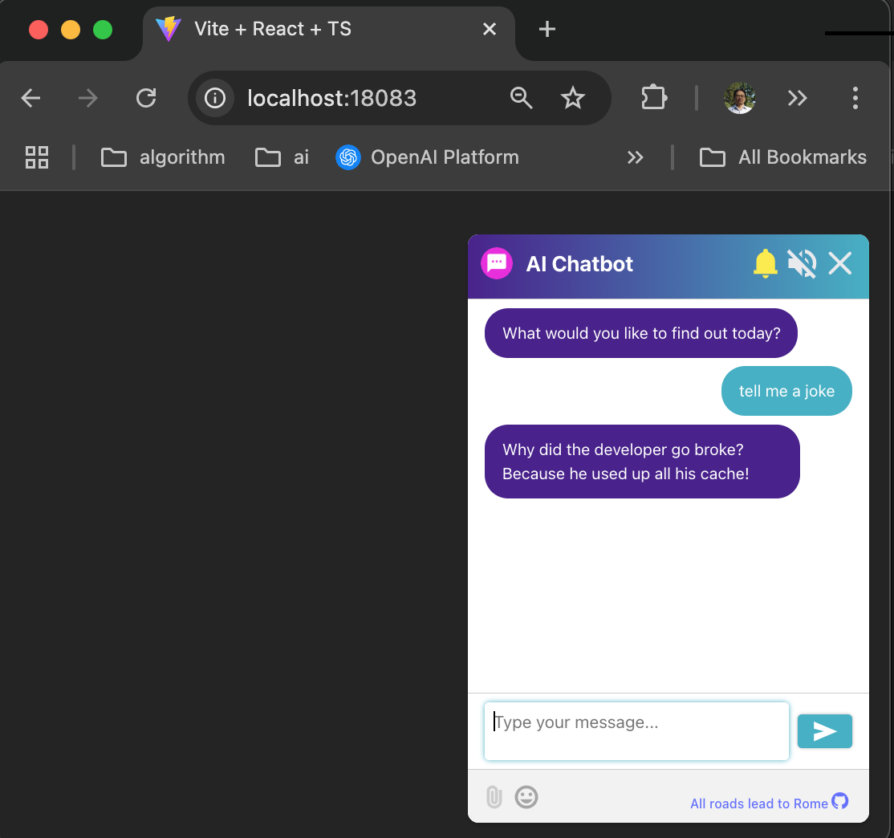

# AI Chatbot

AI Chatbot is a lightweight AI chat web app built with vite+react to work with [AI Command Line Tool](https://github.com/qiangli/ai) hub services.



## Install and Run

```bash
# pnpm install
just install

# pnpm build
just build

# go run server/main.go
just start
```

## AI Hub Service

Check out and build [AI Command Line Tool](https://github.com/qiangli/ai)

```bash
# ai --hub --hub-address ":58080" --hub-pg-address ":5432" --hub-mysql-address ":3306" --hub-redis-address ":6379" --agent ask --verbose

just hub
```

## UI

Visit UI Client [http://localhost:18083](http://localhost:18083)

