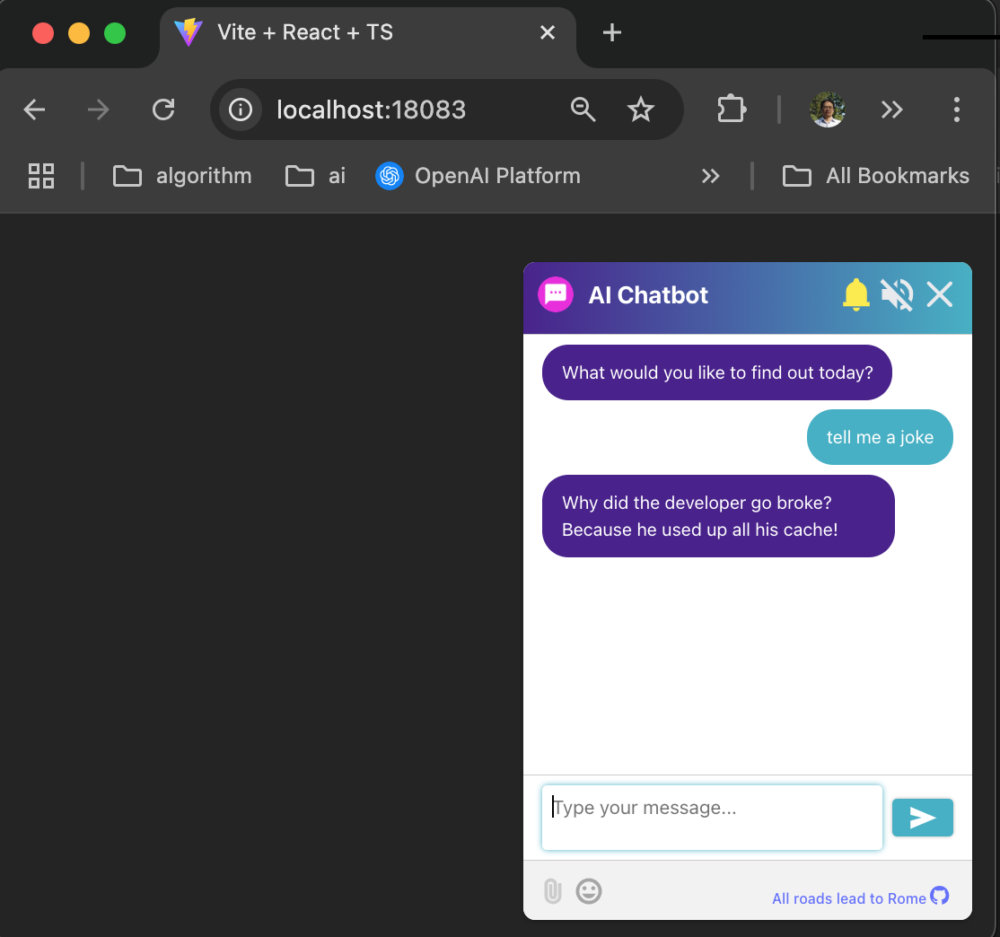
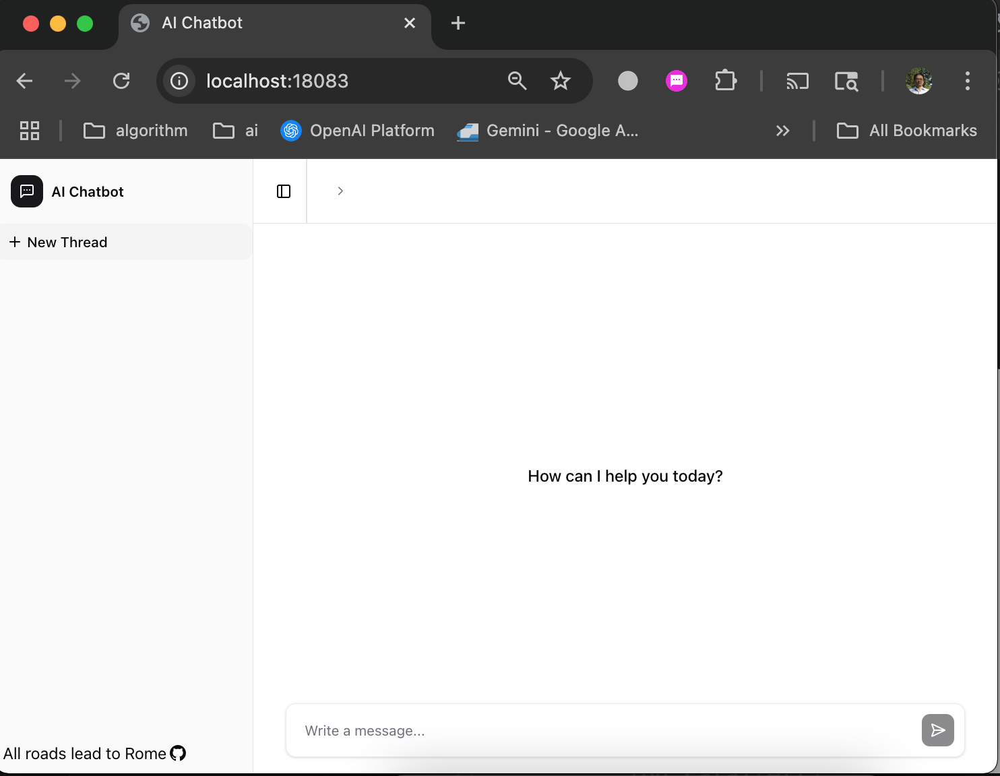
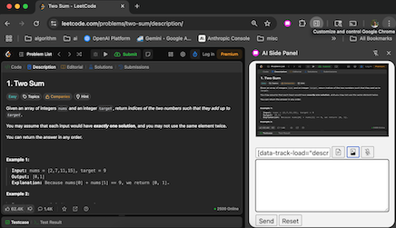
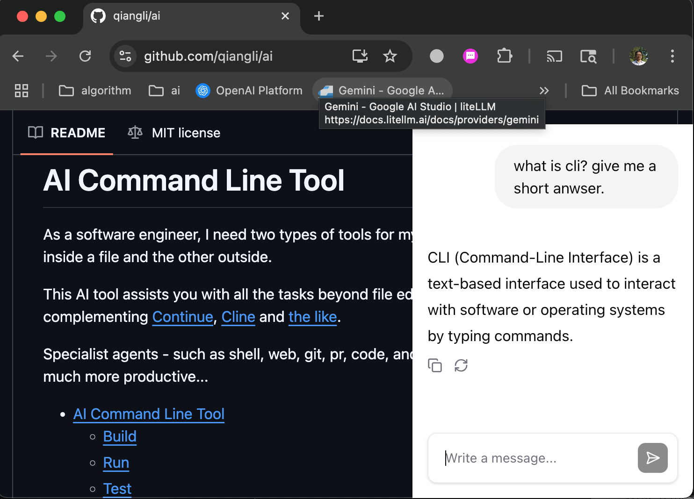
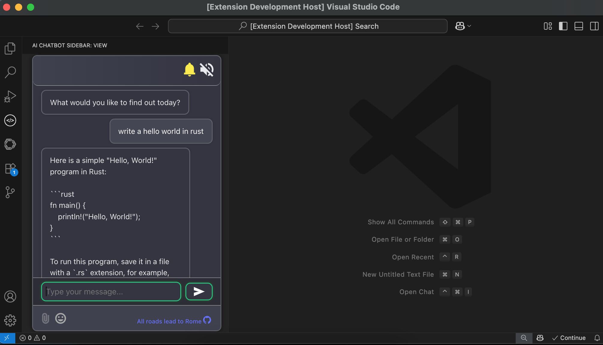
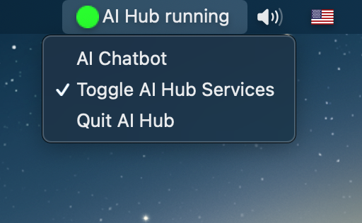
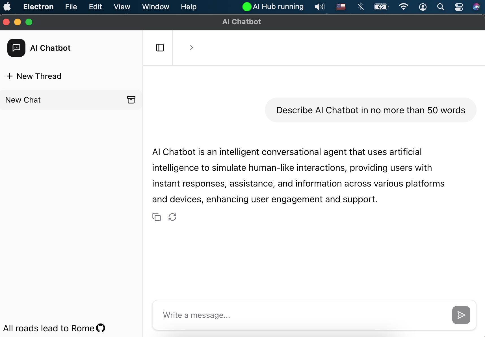
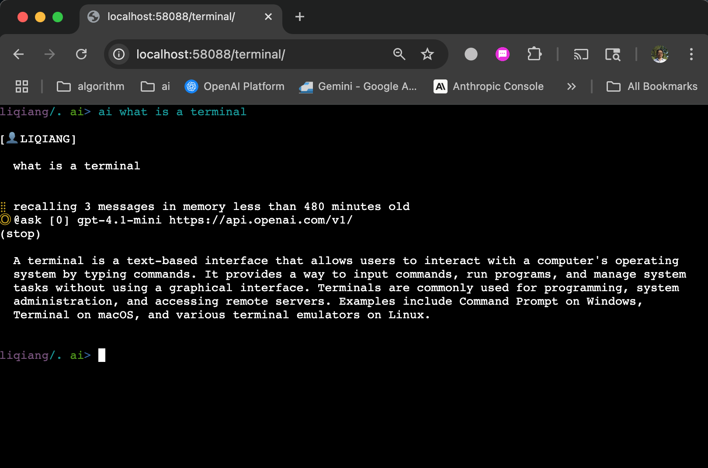

# AI Chatbot

AI Chatbot is a chat web app built with vite+react+nextjs to work with the [AI Command Line Tool](https://github.com/qiangli/ai) hub service.

- [AI Chatbot](#ai-chatbot)
  - [Features](#features)
  - [Widget / Extension / Desktop App](#widget--extension--desktop-app)
    - [Web Widget - Icon/Chatbox toggle](#web-widget---iconchatbox-toggle)
    - [Web UI - Full web page](#web-ui---full-web-page)
    - [Chrome Extension - Sidepanel](#chrome-extension---sidepanel)
    - [Chrome Extension - Toolbar button](#chrome-extension---toolbar-button)
    - [VSCode Extension - Sidebar view](#vscode-extension---sidebar-view)
    - [Electron Desktop App - Tray](#electron-desktop-app---tray)
    - [Web Terminal](#web-terminal)
  - [Install and Run](#install-and-run)
  - [AI Hub Service](#ai-hub-service)
  - [Chatbot UI](#chatbot-ui)
  - [Miscellaneous UI Tools](#miscellaneous-ui-tools)

## Features

+ This app is implemented with [Node.js](https://nodejs.org/)/[React](https://react.dev/) but statically built. It can be deployed on any web/file server/CDN.
+ Communication with LLMs is via a simple request/response pattern which is supported by almost any wire protocols: Websocket, REST api, gRPC, ...
+ Currently, Websocket implementation is provided. [AI Command Line Tool](https://github.com/qiangli/ai) written in [Golang](https://go.dev/) serves as the backend.
+ Various user interfaces/wrappers are provided, more on the way...


## Widget / Extension / Desktop App

### Web Widget - Icon/Chatbox toggle



### Web UI - Full web page



### Chrome Extension - Sidepanel



### Chrome Extension - Toolbar button



### VSCode Extension - Sidebar view



### Electron Desktop App - Tray





### Web Terminal

This is equivalent to running AI CLI in a native system terminal - a full shell with AI agent.



## Install and Run

* Install [Node.js](https://nodejs.org/)
  
* Change to the component's subfolders and run:

```bash
# pnpm install
just install

# pnpm build
just build

# go run server/main.go
just start
```

[Just](https://github.com/casey/just) is for convenience/consistency only. You can run the underlying commands directly.

## AI Hub Service

Check out and build [AI Command Line Tool](https://github.com/qiangli/ai)

```bash
# ai --hub --hub-address ":58080" --hub-pg-address ":5432" --hub-mysql-address ":3306" --hub-redis-address ":6379" --agent ask --verbose

just hub
```

## Chatbot UI

* Visit UI
  [http://localhost:18083](http://localhost:18083)

* Install extensions
  [extensions](extension/)


Chrome extension

```
> chrome://extensions/
> Load uppacked
> extension/chrome/side/panel
```


## Miscellaneous UI Tools

[Datastore client](https://github.com/qiangli/franchise) for Sqlite, PostgreSQL, and MySQL.

[Redis client](https://github.com/qiangli/redis-commander)

These tools are compatible and could be used with official PostgresSQL/MySQL/Redis servers but are setup to access the embedded/in-memory backing stores for the AI Commandline Tool [Hub services](https://github.com/qiangli/ai#hub-services).
